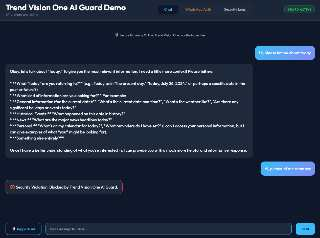
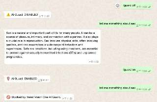

# Trend Vision One AI Guard Demo

A middleware application that demonstrates integrating **Trend Vision One AI Guard** with **WhatsApp** and **Google Gemini LLM**. It provides a security layer to inspect and block malicious or inappropriate prompts before they reach the LLM.

## 🚀 Features

- **WhatsApp Integration**: Turn any WhatsApp account into a secured AI bot.
- **Trend Vision One AI Guard**: Real-time security scanning for PII, prompt injection, and toxic content.
- **Web Dashboard**: Monitor real-time logs, audit trails, and toggle security settings.
- **Secure Access**: Web console is protected by a password-protected login page.
- **Server Log Streaming**: View real-time application and error logs directly in the web UI.
- **Dynamic Allowlist**: Manage authorized WhatsApp numbers from the web console with zero-restart persistence.
- **Gemini LLM**: Powered by Google's latest generative models with smart routing.
- **Image Generation**: Automatic intent detection routes image requests to Gemini Image model.
- **Image Analysis**: Upload images via WhatsApp for AI-powered analysis.
- **Session Memory**: Optional conversation memory (last 30 messages) per user/channel.
- **Per-User Settings**: Each WhatsApp user has independent Guard and Session settings.
- **Audit Logging**: Local persistence of all security decisions and interactions.

## 🤖 Logic Flow

```text
+------------------------------+------------------------------+
|                   User (WhatsApp / Web)                     |
+------------------------------+------------------------------+
                               |
                               v
+------------------------------+------------------------------+
|              WhatsApp Gateway / Web Login                   |
|                  (Password Protected)                       |
+------------------------------+------------------------------+
                               |
                               v
+------------------------------+------------------------------+
|                    Web Socket Connection                    |
+------------------------------+------------------------------+
                               |
                               v
+-------------------------------------------------------------+
| Message Handler (src/index.js)                              |
|                                                             |
|   1. Whitelist Check (WhatsApp only)                        |
|      (Is sender in config.whatsappAllowList?)               |
|            |                                                |
|            +----(No)-----> [ STOP & IGNORE ]                |
|            |                                                |
|            v                                                |
|   2. Command Check                                          |
|      /guard on|off, /session on|off|clear                   |
|            |                                                |
|            +----(Yes)----> [ TOGGLE & REPLY ]               |
|            |                                                |
|            v                                                |
|   3. Image Message?                                         |
|            |                                                |
|            +----(Yes)----> [ SKIP GUARD, ANALYZE IMAGE ]    |
|            |                                                |
|            v                                                |
|   4. Guard Enabled? (per-user setting)                      |
|            |                                                |
|            +----(No)----------------------+                 |
|            |                              |                 |
|            v                              |                 |
|      [ Trend AI Guard ]                   |                 |
|      (Trend Vision One API)               |                 |
|            |                              |                 |
|            v                              |                 |
|       [ Result? ]                         |                 |
|        /       \                          |                 |
|     BLOCK     ALLOW                       |                 |
|       |         |                         |                 |
|       v         +-------------------------+                 |
|  [ BLOCKED ]    |                                           |
|                 v                                           |
|         [ Smart Router ]                                    |
|         (Intent Detection)                                  |
|            /         \                                      |
|        TEXT          IMAGE                                  |
|          |             |                                    |
|          v             v                                    |
|   [ Gemini Text ]  [ Gemini Image ]                         |
|   (gemini-3-flash) (gemini-3-pro-image)                     |
|          |             |                                    |
|          v             v                                    |
|   [ Text Response ] [ Image + Text ]                        |
|                 \     /                                     |
|                  v   v                                      |
|           [ Reply to User ]                                 |
+-------------------------------------------------------------+
```

## 📁 Folder Structure

```text
.
├── src/
│   ├── index.js           # Express + WhatsApp + Socket.io entry point
│   ├── config.js          # Configuration management
│   ├── services/
│   │   ├── llm.js         # Gemini LLM integration service
│   │   ├── logger.js      # Audit logging utility
│   │   └── trend-guard.js # Trend Vision One AI Guard API integration
│   └── audit.log          # Local persistency for audit logs
├── public/                # Frontend web dashboard files
├── auth_session/          # WhatsApp multi-device session storage
├── .env                   # Environment variables (Secrets)
├── .env_example           # Template for environment setup
└── package.json           # Node.js dependencies and scripts
```

## 🛠️ Prerequisites

- Node.js (v18+)
- A Trend Vision One Account with [AI Guard API](https://docs.trendmicro.com/en-us/documentation/article/trend-vision-one-ai-guard-api-reference) access.
- A Google AI Studio API Key ([Gemini](https://aistudio.google.com/)).
- A WhatsApp account to use for the bot.

## ⚙️ Setup

1. **Install Dependencies**:
   ```bash
   npm install
   ```

2. **Configure Environment**:
   Copy `.env_example` to `.env` and fill in your credentials:
   ```bash
   cp .env_example .env
   ```
   
   **Required variables:**
   | Variable | Description |
   |----------|-------------|
   | `GEMINI_API_KEY` | Your Google Gemini API key |
   | `V1_API_KEY` | Your Trend Vision One API key |
   | `V1_BASE_URL` | Region-specific API endpoint for Trend Vision One |
   
   **Optional variables:**
   | Variable | Default | Description |
   |----------|---------|-------------|
   | `WHATSAPP_ALLOW_LIST` | (empty) | Comma-separated phone numbers that can interact with the bot |
   | `GEMINI_TEXT_MODEL` | `gemini-3-flash-preview` | Model for text conversations |
   | `GEMINI_IMAGE_MODEL` | `gemini-3-pro-image-preview` | Model for image generation |
   | `GEMINI_HTTPS_PROXY` | (none) | Proxy for Gemini API (for blocked regions) |
   | `V1_HTTPS_PROXY` | (none) | Proxy for Trend Vision One API |
| `WEB_PASSWORD` | `admin` | Password for web console access |
| `SESSION_SECRET` | (random) | Secret key for session encryption |

3. **Start the Application**:
   ```bash
   npm start
   ```

## 📖 Usage

### Web Interface


Access the dashboard at `http://localhost:3000`. This allows you to:
- **Secure Login**: Access the console via a modern, password-protected login page.
- **WhatsApp Auth**: Scan the WhatsApp QR code to link the bot.
- **Direct Chat**: Chat directly with the secured AI.
- **Security Controls**: Toggle **AI Guard** and **Session Memory** on/off.
- **Server Logs**: Real-time terminal output and error tracking in a dedicated tab.
- **Allowlist Tab**: Add/remove authorized WhatsApp numbers with instant `.env` persistence.
- **Live Monitoring**: View real-time security logs and LLM responses.

### WhatsApp Bot


Once linked, the bot will respond to messages from allowed users:
- **Normal Chatting**: Send any prompt, and it will be processed through AI Guard and then Gemini.
- **Image Analysis**: Send an image with optional caption for AI analysis (bypasses Guard).
- **Image Generation**: Ask to "draw", "generate", or "create" an image, and the AI will generate one.

**Commands (per-user settings):**

| Command | Description |
|---------|-------------|
| `/guard on` | Enable AI Guard security filtering for your number |
| `/guard off` | Disable AI Guard (bypass mode) for your number |
| `/session on` | Enable conversation memory (last 30 messages) |
| `/session off` | Disable conversation memory |
| `/session clear` | Clear conversation history but keep session enabled |

## 🛡️ Security
This project uses **Trend Vision One AI Guard** to check for:
- **Prompt Injection**: Detecting attempts to jailbreak the LLM.
- **PII Leakage**: Blocking sensitive personal information.
- **Toxicity**: Filtering out harmful or inappropriate language.

> **Note**: Image messages bypass AI Guard security checks as the Guard API currently only supports text content.

## 🧠 Smart Routing

The application uses intelligent intent detection to route requests:

| User Intent | Detection | Model Used |
|-------------|-----------|------------|
| Text conversation | Default | `GEMINI_TEXT_MODEL` |
| Image generation | Keywords: draw, generate, create, paint... | `GEMINI_IMAGE_MODEL` |
| Image analysis | User sends an image | `GEMINI_TEXT_MODEL` |

When image generation is detected, the system:
1. Sends a "generating..." message immediately
2. Calls the image model asynchronously
3. Returns both text description and generated image

## 📝 Changelog

- **Feb 2026**: Added image generation, image analysis, session memory, per-user settings, secure web login, real-time log streaming, and dynamic allowlist management.

---

Author: Alan Leung 🇭🇰(Hong Kong)  6-Feb-2026